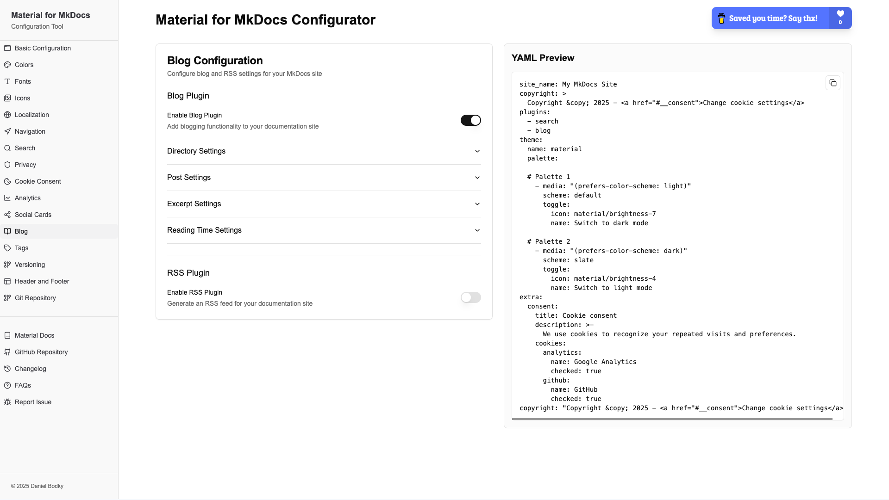

# Material for MkDocs Configurator



## Motivation

This tool provides an intuitive interface for configuring your Material for MkDocs site without having to manually edit the config. It allows you to:

- Visually customize your Material for MkDocs theme
- Preview changes in real-time
- Export your configuration as a ready-to-use `mkdocs.yml` file
- Save time on theme configuration and focus on your documentation content

I found that, while an excellent and thorough reference, the Material for MkDocs documentation sometimes is a bit
_too much_, as in:

- There might be features useful to you within Material for MkDocs, but you never come across them in the docs.
- There might be some incompatibilities between available features

This configuration UI surfaces all available options, plugins, and features grouped by category, and takes care
of racing conditions or incompatibilities.

> [!NOTE] 
> **This project is not affiliated with, endorsed by, or connected to Material for MkDocs in any way.** It is an independent tool created to help users configure their Material for MkDocs sites more easily.

## Development

### Prerequisites

- Node.js (v18 or newer)
- `npm` or `yarn`

### Local Setup

1. Clone the repository:

```bash
git clone https://github.com/yourusername/material-mkdocs-configurator.git
cd material-mkdocs-configurator
```

2. Install dependencies:

```bash
npm install
# or
yarn install
```

3. Start the development server:

```bash
npm run dev
# or
yarn dev
```

4. Open [http://localhost:3000](http://localhost:3000) in your browser to see the application.

## Contributing

Contributions are welcome! Please feel free to submit a Pull Request.

1. Fork the repository
2. Create your feature branch (`git checkout -b feature/amazing-feature`)
3. Commit your changes (`git commit -m 'Add some amazing feature'`)
4. Push to the branch (`git push origin feature/amazing-feature`)
5. Open a Pull Request

## License

This project is licensed under the MIT License - see the [LICENSE](LICENSE) file for details.

## Acknowledgements

This project wouldn't be possible without these amazing open-source projects:

- [Material for MkDocs](https://squidfunk.github.io/mkdocs-material/) - The beautiful documentation theme this configurator is built for
- [Next.js](https://nextjs.org/) - The React framework powering this application
- [TailwindCSS](https://tailwindcss.com/) - The utility-first CSS framework used for styling
